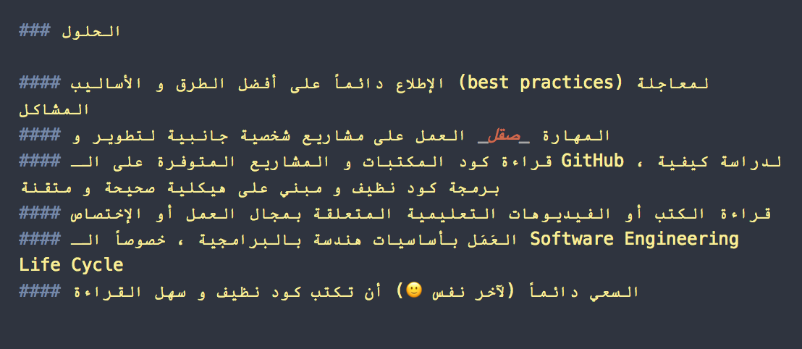
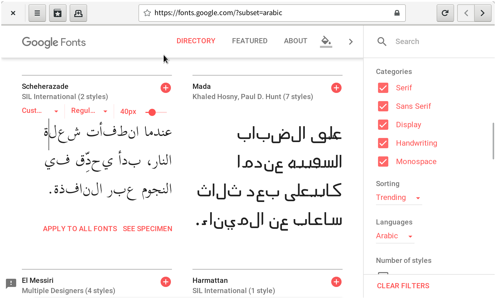

  <!-- .element width="200px" -->

# Arabic-Sucks
A list of poorly handling of Arabic language in mobile, web, and desktop applications.

Arabic language has millions of users on the Internet

Arabic language is written from right-to-left (RTL), 

Arabic issues
* rendered as LTR
* disconnected characters
*  

## Mobile - iOS
### Netflix

iOS 

## Mobile - Android

## Desktop
### Visual Studio Code
[issue N]() still open

### WebKitGtk

[tweet](https://twitter.com/KhaledGhetas/status/921826612496224261)

### MacDown

### Affinity Photo

### Sublime
[issue N]() still open

### 