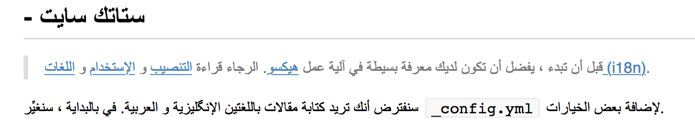

A list of poorly-handled Arabic language rendering in mobile, web, and desktop applications.

🔸 Arabic language has about 100 millions of users on the Internet [*](http://www.internetworldstats.com/stats5.htm) 
🔸 written (and direction) from right-to-left (RTL) and _not_ from left-to-right (LTR) 
🔸 has continus word characters, _not_ splitted 
🔸 [UTF BIDI specs](http://unicode.org/reports/tr9/) 

> Please help contribute to the list, any issues are welcomed 🙏

## Mobile - iOS
### Netflix (9.42.1)

## Desktop, macOS

### Visual Studio Code (1.17.2)
[Support for rtl languages](https://github.com/Microsoft/vscode/issues/11770) open since Sep 9, 2016.  

### WebKitGtk (2.19.1)

 [*](https://twitter.com/KhaledGhetas/status/921826612496224261)

### MacDown (0.7.1)

### Affinity Photo (1.6.6)

### Sublime (1.17.2)
[ [RTL] Sublime Text and Arabic, Persian, Hebrew languages #109 ](https://github.com/SublimeTextIssues/Core/issues/109) open since Jul 22, 2013.

